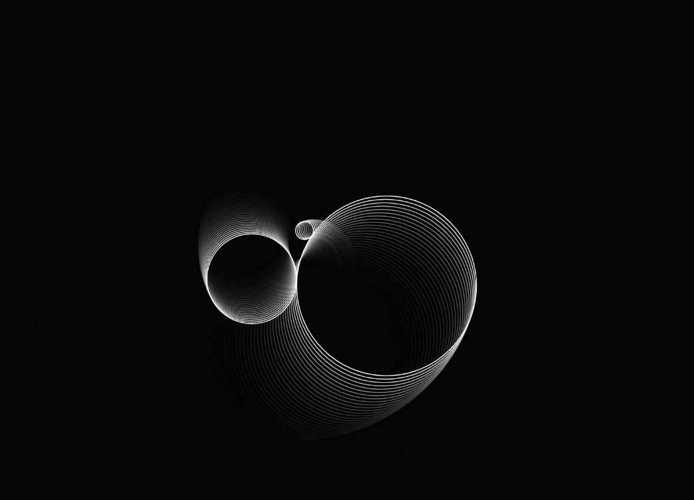
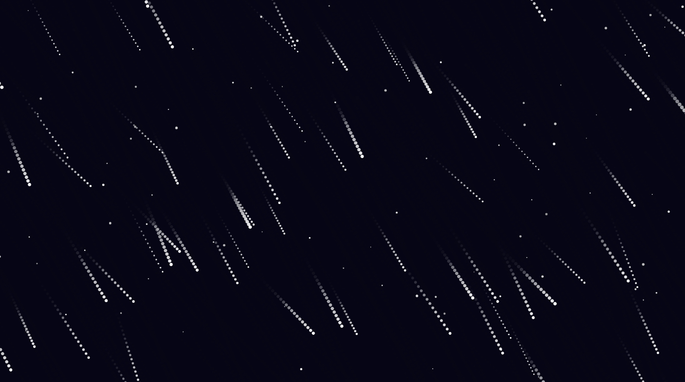
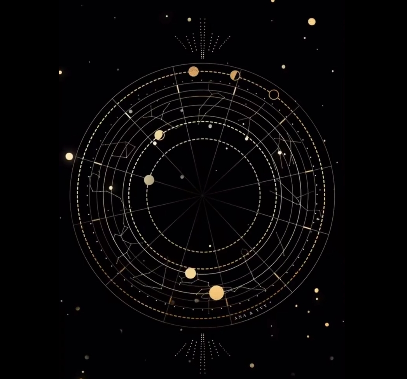
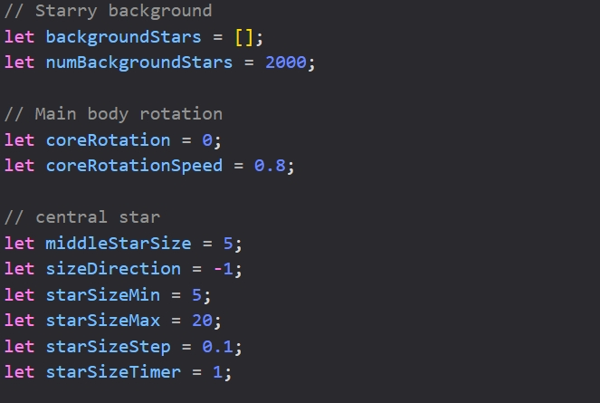
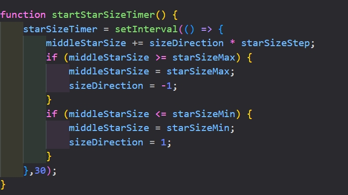
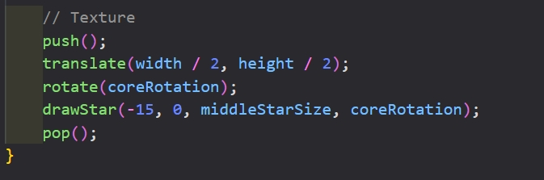
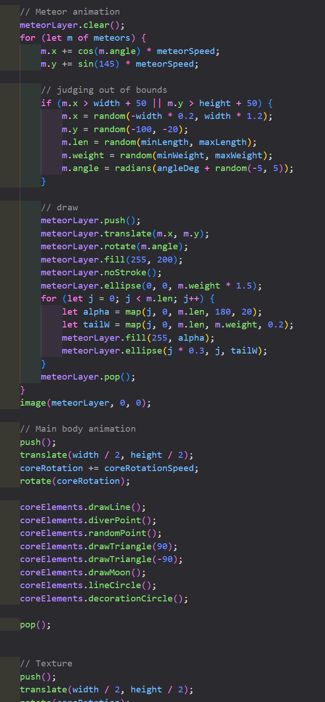
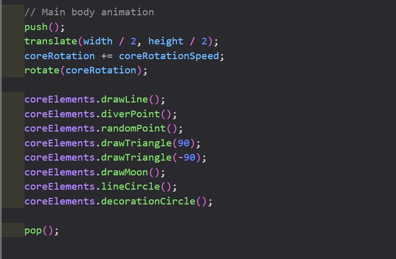

# Wheels of universe——Time-Based Cosmic Cycle Animation
## Overview：
Wheels of universe is a time-based looping animation effect that simulates a running universe. It consists of three parts: a randomly generated starry sky, dynamically looping meteors, and a planet with rotation as the main effect.

## How to interact?
### •Just open the page
All effects will play automatically after the web page is opened and will loop infinitely.
### •Resize your browser window
The canvas and all visuals will adapt responsively, always filling the window.

## Select animation method
**Time-Based:** Employ timers and events for animation.

## My Individual Approach
### Meteors:
Each meteor uses a class instance storing its own angle, length, weight and speed, and moves diagonally (right-down, controlled by angleDeg around 145°).
Tail length, direction and respawn logic create natural meteor showers.

### Central star:
#### Breathing Central Star
At the very center is a stylized star shape, which constantly expands and contracts in a “breathing” motion.

The star’s radius is updated each frame using a simple increment/decrement approach (middleStarSize += sizeDirection * starSizeStep). When it reaches the upper or lower threshold, the direction reverses, creating a smooth and continuous “breathing” cycle.

#### Rotating Orb
Surrounding the pulsing star is a set of concentric circular forms and decorative elements that rotate as a group around the center.

The entire structure is rotated by incrementing a coreRotation angle and applying a rotate(coreRotation) transformation within a push()/pop() block. All elements drawn inside this block inherit the rotation, resulting in smooth, continuous motion.

#### Radiating Rays
A network of lines outward from the core, like energetic bursts.

These are drawn using functions such as .drawLine() and .diverPoint(), which calculate positions using trigonometric functions to spread points and lines evenly around the center.

#### Orbiting Circles
Several small circles move along concentric paths (orbits) around the central star, forming dynamic, animated “rings.”

Circular positions are calculated for each point along the orbit, with possible randomization or phase differences to avoid uniformity. In the code, this is achieved by functions like .decorationCircle(), which uses trigonometric formulas to place circles along circular paths.

#### Summary
My animation focuses on showing the state of the movement of planets in the universe. I use time-loop animation to correspond to each part, trying to show the laws of the operation of the universe.

## Visual & Artistic Inspiration
Reference 1:https://openprocessing.org/sketch/1150505 
Reference 2:https://openprocessing.org/sketch/2567734 
Reference 3:https://www.pinterest.com/pin/70437487264302/ 

#### These works inspired my decision to:
1. Use real-world diagonal angles for meteors, not just horizontal/vertical.

2. Design a rotating and running main object.

## Details of My Individual Approach to Animating the Group Code
### 1. Animation Mode:
I migrated most of the rendering logic into the draw() function, allowing continuous animation. This enabled:

3.1. A “breathing” central star, whose size changes frame-by-frame (see the middleStarSize update).

3.2. Continuous rotation of the central structure, achieved by incrementing and applying coreRotation.

3.3. Animated meteor showers, where each meteor’s position is updated on every frame, making the meteors move across the screen.

### 2. Meteor Layer
I turned meteors into objects with state (x, y, angle, etc.), and update their positions every frame. When meteors move off-screen, they are re-initialized at new starting positions, creating a seamless, infinite meteor shower.

### 3. Central Star Breathing Animation
I implemented a “breathing” effect by periodically increasing and decreasing the star’s radius variable (middleStarSize), making the core star appear to pulsate.

### 4. Central Structure Rotation
The entire central structure is rotated by updating coreRotation every frame and applying a rotation transform with rotate(coreRotation). All the methods of the createMutipleCircle class are now affected by this rotation, causing the whole system to spin.

## Technical Explanation
1. 

Added the definition of animation variables in meteor and subject to facilitate the later adjustment of parameters

2. 

**Radius modulation:** Dynamically scaled every 30 milliseconds via a sine-wave interpolation, producing a slow grow-shrink loop.

**Position synchronization:** The effect tracks the main body's motion, ensuring the visual focal point remains dynamic.

3. 

**Dynamic Meteor Animation Implementation**
· Frame Reset: meteorLayer.clear() ensures clean redraw.
· Direction: Trigonometric functions (cos()/sin())
· Speed: Scaled by meteorSpeed
· Boundary Reset: if() triggers repositioning when meteors exit view
4. Layered Rendering: State-safe drawing via push()/pop(), merged via image().

5. 

Each frame increments coreRotation, driving the entire animation's rotational motion.